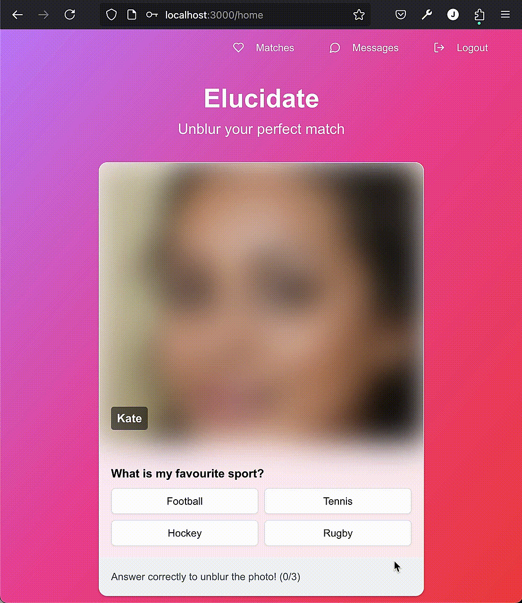

# Elucidate (Dating Webapp)

A modern dating application built using Next.js, React, PostgreSQL, and Tailwind CSS. This app allows users to sign up, log in, like/dislike other user profiles, and view potential matches in real-time.

# Screenshots and Demos

### 1. Home Page
This is a demo of the home page of the application where the users can view other profiles. Each user sets up 3 multiple choice questions that are tied to their profile. On the profile setup page each user creates 4 options for each of their questions (one correct answer).

When users are shown other profiles on the home page, the multiple choice questions appear and the profile image is blurred.
For every question the user answers correctly, the profile image will become less burred. If the user answers all 3 questions correctly the profile picture will become clear. After the user answers all three questions, a like/dislike button will appear on the profile and the user can decide whether to like/dislike that profile.



### 2. Matches/Messages page

On the matches page users can view all the profiles of users that they have matched with (when both users like each others profile).
The messages page allows users that have matched to message each other. 


### 3. Login/Sign Up


### Profile Setup


## Features

- **User Authentication**: Secure login and sign-up using email and password.
- **User Profiles**: Users can set up and update their profiles with photos, bios, and other details.
- **Matching System**: Users can like/dislike other users, and potential matches are shown based on mutual interests.
- **Real-time Chat**: Messaging functionality allows users to chat once they match with each other.
- **Responsive Design**: The app is fully responsive and optimized for both desktop and mobile views.

## Technologies Used

- **Frontend**:
  - [Next.js](https://nextjs.org/) - React-based framework for building modern web applications.
  - [React](https://reactjs.org/) - JavaScript library for building user interfaces.
  - [Tailwind CSS](https://tailwindcss.com/) - Utility-first CSS framework for fast UI development.
  - [TypeScript](https://www.typescriptlang.org/) - Typed superset of JavaScript for building more robust and maintainable code.

- **Backend**:
  - [Node.js](https://nodejs.org/) - JavaScript runtime built on Chrome's V8 engine.
  - [Express.js](https://expressjs.com/) - Minimal and flexible Node.js web application framework for building APIs.
  - [PostgreSQL](https://www.postgresql.org/) - Open-source relational database system for storing user and match data.
 
- **Authentication**:
  - Secure authentication using JWT (JSON Web Tokens) for login and session management.

## Setup and Installation

To get started with the app locally, follow these steps:

### 1. Clone the repository

```bash
git clone https://github.com/joshua-onley/dating-app.git
cd dating-app
```
### 2. Install dependencies
make sure you have Node.js installed. Then run: npm install

### 3. Setup local SQL database
For this project i used a local PostgreSQL server running on my machine. Make sure you have PostgreSQL installed by following the instructions on the official PostgreSQL website: <a>https://www.postgresql.org/download/</a>. Once PostgreSQL is installed you must connect to PostgreSQL; create a new database for the app; and connect to this new database.

### 4. Create database tables
After setting up the PostgreSQL database, you must create the necessary tables manually using the following SQL commands: 

Create the Users table:
```
CREATE TABLE users (
    user_id SERIAL PRIMARY KEY,
    name VARCHAR(255),
    email VARCHAR(255) NOT NULL UNIQUE,
    password VARCHAR(255) NOT NULL,
    created_at TIMESTAMP DEFAULT CURRENT_TIMESTAMP,
    photo VARCHAR(255),
    gender VARCHAR(10),
    age INTEGER,
    showtouser VARCHAR(6),
    showuserprofileto VARCHAR(6)
);
```
Create the Questions table:
```
CREATE TABLE questions (
    id SERIAL PRIMARY KEY,
    user_id INTEGER,
    question_text TEXT,
    correct_answer VARCHAR(255),
    FOREIGN KEY (user_id) REFERENCES users(user_id)
);
```

Create the Options table:
```
CREATE TABLE options (
    id SERIAL PRIMARY KEY,
    question_id INTEGER,
    option_text VARCHAR(255),
    FOREIGN KEY (question_id) REFERENCES questions(id)
);
```

Create the likes table: 
```
CREATE TABLE likes (
    id SERIAL PRIMARY KEY,
    liker_id INTEGER NOT NULL,
    liked_id INTEGER NOT NULL,
    created_at TIMESTAMP DEFAULT CURRENT_TIMESTAMP,
    CONSTRAINT likes_liker_id_liked_id_key UNIQUE (liker_id, liked_id),
    FOREIGN KEY (liker_id) REFERENCES users(user_id) ON DELETE CASCADE,
    FOREIGN KEY (liked_id) REFERENCES users(user_id) ON DELETE CASCADE
);
```
Create the dislikes table:
```
CREATE TABLE dislikes (
    id SERIAL PRIMARY KEY,
    disliker_id INTEGER NOT NULL,
    disliked_id INTEGER NOT NULL,
    created_at TIMESTAMP DEFAULT NOW(),
    CONSTRAINT dislikes_disliker_id_disliked_id_key UNIQUE (disliker_id, disliked_id),
    FOREIGN KEY (disliker_id) REFERENCES users(user_id) ON DELETE CASCADE,
    FOREIGN KEY (disliked_id) REFERENCES users(user_id) ON DELETE CASCADE
);
```

Create the messages table:
```
CREATE TABLE messages (
    message_id SERIAL PRIMARY KEY,
    sender_id INTEGER NOT NULL,
    receiver_id INTEGER NOT NULL,
    message_text TEXT NOT NULL,
    created_at TIMESTAMP DEFAULT CURRENT_TIMESTAMP,
    FOREIGN KEY (sender_id) REFERENCES users(user_id),
    FOREIGN KEY (receiver_id) REFERENCES users(user_id)
);

```
### 5. Setup environment variables
create a .env.local file in the root of the project which contains the following variables. You will need to assign values to these variables that depend on how you setup PostgreSQL.

```
DB_USER=your_db_user
DB_HOST=localhost
DB_NAME=your_database_name
DB_PASSWORD=your_db_password
DB_PORT=5432

```
Create a .env file in the root of the project and add your session secret. You can generate a random secret using a tool such as openssl 
```
openssl rand -base64 32
```

```
SESSION_SECRET=your_randomly_generated_session_secret
```

### 6. Start the development server

To start the development server and view the app in your browser, run the following comand:
```
npm run dev
```
### 7. Contributing

If you'd like to contribute to the project, feel free to fork the repository, create a feature branch, and submit a pull request with your proposed changes.
